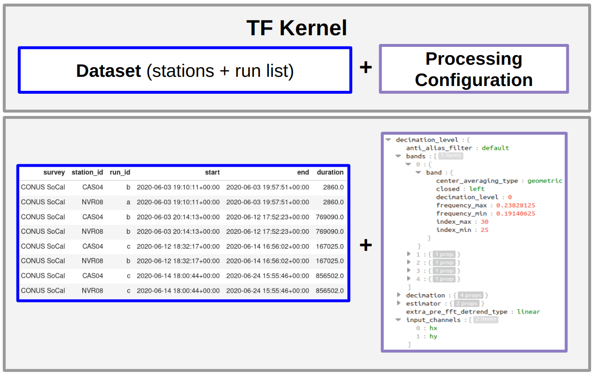

# Summary

The Aurora software package robustly estimates single station and remote reference electromagnetic transfer functions (TFs) from magnetotelluric (MT) time series.  Aurora is part of an open-source processsing workflow that leverages the self-describing data container MTH5, which in turn leverages the general mt\_metadata framework to manage metadata.  These pre-existing tools greatly simplify the processing interface, reducing requirements for specialized domain knowledge in time series analysis, or data structures manangement and generating transfer functions with a few lines of code.  The processing depends on two inputs -- a table specifying the data to use for TF estimation, and a json file specfiying the processing parameters, both of which are generated automatically, and can be modified if desired.  Output TFs are returned as mt\_metadata objects, and can be exported to a variety of common formats for plotting, modelling and inversion.  

# Introduction

Magnetotellurics (MT) is a geophysical technique for probing the electrical conductivity structure of the subsurface using co-located electric and magnetic field measurements.  After data collection, standard practice is to estimate the time invariant  (frequency domain) transfer function (TF) between electric and magnetic channels before proceeding to interpretation and modelling. When all channels are othogonal the TF is equivlent to the 2x2 Impedance Tensor (Z) electrical impedance tensor (Z) [@Vozoff:1991].  


$\begin{bmatrix} E_x \\ E_y \end{bmatrix}
=
\begin{bmatrix} 
Z_{xx} & Z_{xy} \\ 
Z_{yx} & Z_{yy} 
\end{bmatrix}
\begin{bmatrix} H_x \\ H_y \end{bmatrix}$
 
where ($E_x$, $E_y$), ($H_x$, $H_y$) denote orthogonal electric and magnetic fields respectively.  TF estimation involves management of metadata (locations, orientations, timestamps,) versatile data containers (for linear algebra, slicing, plotting, etc.) and uses a broad collection of signal processing and statistical techniques (@egbert1997robust and references therein).  MTH5 supplies time series as xarray objects for efficient, lazy access to data and easy application of linear algebra and statistics libraries available in the python.

# Statement of Need

Uncompiled FORTRAN processing codes have been available for years (@chave1989birrp, @egbert2017mod3dmt) but do not offer the readability of a high-level languge and modifications are not often attempted [@egbert2017mod3dmt]. Recently several python versions of MT processing codes have been released by the open source community, including @shah2019resistics, @smai2020razorback, @ajithabh2023sigmt, and @mthotel.  Aurora adds to this canon of options but differs by leveraging the MTH5 and mt\_metadata packages elimiating a need for internal development of time series or metadata containers.  By providing an example of workflows which employ mt_metadata and mth5 as interfaces we hope that other developers will benefit from following this model, allowing researchers interested in signal-and-noise separation in MT to spend more time exploring and testing algorithms to improve TF estimates, and less time (re)-developing formats and management tools for data and metadata. As a python representation of Egbert's EMTF Remote Reference processing software, Aurora also provides a sort of continuity in the code space as the languages evolve.  

This manuscript describes the high-level concepts of the software – for information about MT data processing @ajithabh2023sigmt provides a concise summary, and more in-depth details can be found in @Vozoff:1991, @egbert2002processing and references therein.  


# Key Features
Simplifies:

- Data indexing and management (via run summary) is tabular (pandas data frames), allowing simple programatic editting, or editting in a spreadsheet or text file.
- Processing parameters configuration interface (JSON) can be editted in a file or programatically with JSON represented as a dictionary


Central to Aurora's process flow is the fact that an instance of a TF depends on two key prior decisions: a) The data input to the TF computation algorithm, b) the algorithm itself including the specific values of the various processing parameters.  These concepts are formalized as classes (KernelDataset and Processing, respectively), and a third class TransferFunctionKernel (TFK Figure \ref{TFK}), a compositon of the Processing, and KernelDataset provides a place for logic validating the data selection and processing parameters . TFK specifies all the information needed to make the calculation of a TF reproducible, thus supporting the R in FAIRly archived TFs.

Generation of robust TFs can be done in only a few lines starting from an MTH5 archive (Figure \ref{minimal_example}).  Simplicity of workflow is due to the MTH5 container already storing comprehensive metadata, including a channel summary table, which describes all the time series stored in the archive including start/end times and sample rates.  With this information already available, users can easily view a tabular summary of available data and select station pairs to process.  Once a station -- and optionally a remote reference station -- are defined, the simultaneous time intervals of data coverage at both stations can be idenitified automatically, providing the Kernel Dataset.  Reasonable starting processing parameters can be automatically generated for a given Kernel Dataset, and can be editted both programatically or via a JSON file. Once the TFK is defined, the rest of the MT processing workflow automatically follows the flow of Figure \ref{FLOW}.



.](aurora_workflow.png)

# Examples

Here an example of the aurora data processing flow is given, using data from Earthscope.  This section refers to several Jupyter notebooks that are intended as a companion to this paper. A relatively general notebook about accessing Earthscope data with mth5 can be found in the link from row 1 of Table \ref{jupyter}.

Table: \label{jupyter} Referenced jupyter notebooks with links.

| ID | Link |
|--|:---|
| 1 | [earthscope_magnetic_data_tutorial](https://github.com/simpeg/aurora/blob/patches/docs/examples/earthscope_magnetic_data_tutorial.ipynb) |
| 2 | [make_mth5_driver_v0.2.0](https://github.com/kujaku11/mth5/blob/master/docs/examples/notebooks/make_mth5_driver_v0.2.0.ipynb) |
| 3 | [process_cas04_mulitple_station](https://github.com/simpeg/aurora/blob/joss/docs/examples/process_cas04_mulitple_station.ipynb) |


The MTH5 dataset can be built by executing the example notebook in the mth5 github repositiory in row 2 of Table \ref{jupyter}.The data processing can be executed by following the tutorial in row 3 of Table \ref{jupyter}.  In that tutorial data from a station (CAS04) archived at Earthscope is processed with descriptive text, which can be condensed to the snippet in in Figure \ref{minimal_example}.  The resultant apparent resistivities are plotted in Figure \ref{compareTFs} along with the results hosted at Earthscope from Egbert's FORTRAN EMTF code.  

![Code snippet with steps to generate a TF from an MTH5 (generated by row 1 of Table \ref{jupyter}).  With MTH5 in present working directory, a table of available contiguous blocks of multichannel time series is generated a "RunSummary", then station(s) to process are selected (by inspection of the RunSummary dataframe) to generate a KernelDataset.  The KernelDataset identifies simultaneous data at the local and reference site, and generates processing parameters, which can be editted before passing them to process_mth5 -- the core processing method, and finally exporting TF to a standardized output file, in this case `edi`. \label{minimal_example}](processing_code_example.png)


# Testing
The Aurora package uses continuous integration [@duvall2007continuous] and implements both unit tests as well as integrated tests with code currently at 77% coverage as measured by CodeCov, and the core dependencies mt_metadata and MTH5 have 84% and 60% of code covered by continuous integration testing respectively.  Improvement of test coverage is ongoing.  For integreated tests Aurora uses a small synthetic MT dataset (originally from EMTF) for TF estimation.  A few processing configurations with manually validated results are stored in the repository. Deviation from these results causes tests to fail, alerting developers that a code change has resulted in an unexpected baseline processing result.  In the summer of 2023, widescale testing on Earthscope data archives was performed and showed that the TF results of auora are similar to those form the EMTF fortran codes, in this case for hundreds of real stations rather than a few synthetic ones.  Before PyPI, and conda forge releases, example Jupyter notebooks are also run via github actions.


# Future Work
Aurora uses github issues to track tasks and planned improvments.  In the near future we want to add noise suppression techniques, for example coherence and polarization sorting and Mahalanobis distance (e.g. @ajithabh2023sigmt, @platz2019automated).  We would also like to develop, or plug into a graphical data selection/rejection interface with time series plotting. Besides these improvments to TF quality, we also would like to embed the TFKernel information into both the MTH5 and the output EMTF\_XML (@kelbert2020emtf). Unit and integrated testing should be expanded, with a larger dataset included in the tests and test coverage on data from audio frequency band (most test data is sampled at 1Hz). This work will continue to codevelop with mt\_metadata, MTH5 and MTPy to maintain the ability to provide outputs for inversion and modelling. Ideally the community can participate in a comparative analysis of the opensource codes available to build a recipe book for handling noise from various datasets, ideally using open-archived datasets.


# Conclusion
Aurora provides an open-source Python implementation of the EMTF package for magnetotelluric data processing.  Aurora is a prototype worked example of how to plug processing into an existing opensource data and metadata ecosystem (MTH5, mt_metadata, & MTpy), and we hope that other open source MT processing authors will follow suit to also provide interfaces to these packages.  It is hoped that these tools will contribute to workflows which can focus more on geoscience analysis, and less on the nuances of data management.


# Appendix

## Installation Instructions
The package is installable via the python Package Index (pip) as well as via conda forge.
The installation in pip:
	pip install aurora
And via conda forge:
	conda install aurora


## Documentation
Documentation is hosted by SimPEG @cockett2015simpeg and can be found at this [link](http://simpeg.xyz/aurora/)


## Licence
Aurora is distributed under the [MIT](https://opensource.org/license/mit/) open-source licence.


# Acknowledgments 
The authors would like to thank IRIS (now Earthscope) for supporting the development of Aurora.


TODO:

- [ ] **Update links to ipynb to release branches after mth5/aurora releases**.

- [ ] remove draft watermark

- [ ] Link these issues to discussion in future work? https://github.com/kujaku11/mth5/issues/179, https://github.com/kujaku11/mt_metadata/issues/195

```python

```