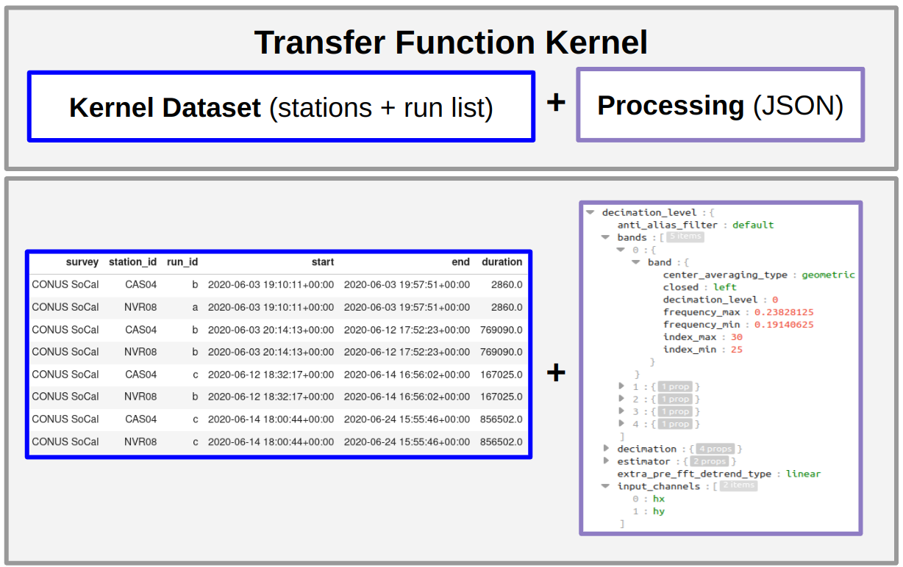
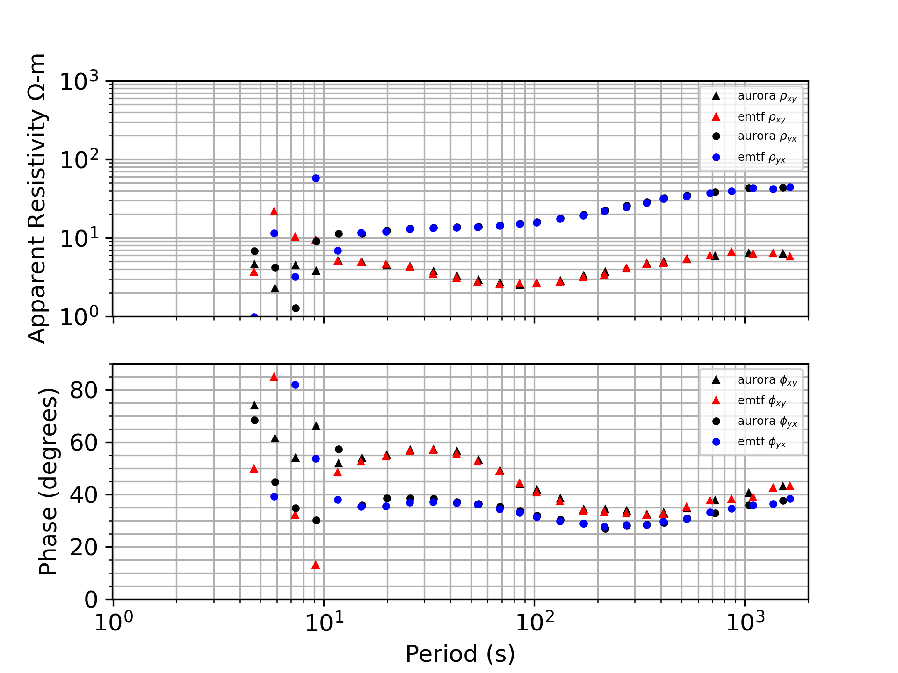

# Summary

The Aurora software package robustly estimates single station and remote reference electromagnetic transfer functions (TFs) from magnetotelluric (MT) time series.  Aurora is part of an open-source processing workflow that leverages the self-describing data container MTH5, which in turn leverages the general mt\_metadata framework to manage metadata.  These pre-existing packages simplify the processing by providing managed data structures, allowing for transfer functions to be generated with only a few lines of code.  The processing depends on two inputs -- a table defining the data to use for TF estimation, and a JSON file specifying the processing parameters, both of which are generated automatically, and can be modified if desired.  Output TFs are returned as mt\_metadata objects, and can be exported to a variety of common formats for plotting, modeling and inversion.  

## Key Features

- Tabular Data indexing and management (pandas data frames), 
- Dictionary-like Processing parameters configuration
- Programmatic or manual editing of inputs
- Largely automated workflow


# Introduction

MT is a geophysical technique for probing subsurface electrical conductivity using co-located electric and magnetic field measurements.  After data collection, standard practice is to estimate the time invariant  (frequency domain) transfer function (TF) between electric and magnetic channels before proceeding to interpretation and modeling. If measurements are orthogonal the TF is equivalent to the electrical impedance tensor (Z) [@Vozoff:1991].  


$\begin{bmatrix} E_x \\ E_y \end{bmatrix}
=
\begin{bmatrix} 
Z_{xx} & Z_{xy} \\ 
Z_{yx} & Z_{yy} 
\end{bmatrix}
\begin{bmatrix} H_x \\ H_y \end{bmatrix}$
 
where ($E_x$, $E_y$), ($H_x$, $H_y$) denote orthogonal electric and magnetic fields respectively.  TF estimation involves requires the E and H time series _and_ metadata (locations, orientations, timestamps,) and uses a collection of signal processing and statistical techniques (@egbert1997robust and references therein).  MTH5 supplies time series as xarray objects for efficient, lazy access to data and easy application of scientific computing libraries available in the python.

# Statement of Need

Uncompiled FORTRAN processing codes have long been available (e.g. EMTF @egbert2017mod3dmt, or BIRRP @chave1989birrp) but lack the readability of high-level languages and modifications to these programs are seldom attempted [@egbert2017mod3dmt]. Recently several python versions of MT processing codes have been released by the open source community, including @shah2019resistics, @smai2020razorback, @ajithabh2023sigmt, and @mthotel.  Aurora adds to this canon of options but differs by leveraging the MTH5 and mt\_metadata packages eliminating a need for internal development of time series or metadata containers.  As a python representation of Egbert's EMTF Remote Reference processing software, Aurora provides a sort of continuity in the MT code space as the languages evolve.  By providing an example workflow employing MTH5 we hope other developers may benefit from following this model, allowing researchers interested in signal-and-noise separation in MT to spend more time exploring and testing algorithms to improve TF estimates, and less time (re)-developing formats and management tools for data and metadata. 


This manuscript describes the high-level concepts of the software – for information about MT data processing @ajithabh2023sigmt provides a concise summary, and more in-depth details can be found in @Vozoff:1991, @egbert2002processing and references therein.  

# Problem Approach

A TF instance depends on two key prior decisions: a) The data input to the TF computation algorithm, b) The algorithm itself including the specific values of the processing parameters.  Aurora formalizes these concepts as classes (KernelDataset and Processing, respectively), and a third class TransferFunctionKernel (TFK Figure \ref{TFK}), a composition of the Processing, and KernelDataset.  TFK provides a place for validating consistency between selected data and processing parameters. and specifies all information needed to make the calculation of a TF reproducible (supporting the R in FAIRly archived TFs).

Generation of robust TFs can be done in only a few lines starting from an MTH5 archive (Figure \ref{minimal_example}).  Simplicity of workflow is due to the MTH5 container already storing comprehensive metadata, including a channel summary table describing all time series stored in the archive including start/end times and sample rates.  Users can easily view a tabular summary of available data and select station pairs to process.  Once a station -- and optionally a remote reference station -- are defined, the simultaneous time intervals of data coverage at both stations are identified automatically, providing the Kernel Dataset.  Reasonable starting processing parameters are automatically generated for a given Kernel Dataset, and can be modified with code or via manual changes to a JSON file. Once the TFK is defined, the processing automatically follows the flow of Figure \ref{FLOW}.



.  Input time series are from MTH5, these can initially be drawn from Phoenix, LEMI, FDSN, Metronix, Zonge, systems etc. and the resultant transfer functions can similarly export to most common TF formats such as .edi, .zmm, ,j, .avg, .xml etc.](aurora_workflow.png)

# Example

This section refers to a Jupyter notebook companion to this paper (archived on GitHub: [process_cas04_mulitple_station](https://github.com/simpeg/aurora/blob/joss/docs/examples/process_cas04_mulitple_station.ipynb)).  This notebook builds an MTH5 dataset from the EarthScope @schultz2010emscope and executes data processing -- a condensed version of which is shown in Figure \ref{minimal_example}.  Resultant apparent resistivities are plotted in Figure \ref{compareTFs} along with the EMTF-generated results hosted at EarthScope.  

![Code snippet with steps to generate a TF from an MTH5.  With MTH5 file ("8P_CAS04_NVR08.h5") in present working directory, a table of available contiguous blocks of multichannel time series is generated ("RunSummary").  -- In this example, the file contains data from two stations, "CAS04" and "NVR08" which are accessed from the EarthScope data archives --  Then station(s) to process are selected (by inspection of the RunSummary dataframe) to generate a KernelDataset.  The KernelDataset identifies simultaneous data at the local and reference site, and generates processing parameters, which can be edited before passing them to process_mth5, and finally exporting TF to a standard output format, in this case `edi`. \label{minimal_example}](processing_code_example.png)




# Testing
Aurora uses continuous integration [@duvall2007continuous] via unit and integrated tests, with ongoing improvement of test coverage is ongoing.  Currently CodeCov measures 77% code coverage (core dependencies mt_metadata and MTH5 at 84% and 60% respectively).  Aurora uses a small synthetic MT dataset for integrated tests.  On push to GitHub the synthetic data are processed and the results compared against manually validated values that are also stored in the repository.  Deviation from expected results causes test failures, alerting developers a code change resulted in an unexpected baseline processing result.  In the summer of 2023, wide-scale testing on EarthScope data archives was performed indicating that the aurora TF results are similar to those form the EMTF fortran codes, in this case for hundreds of real stations rather than a few synthetic ones.  Before PyPI, and conda forge releases, example Jupyter notebooks are also run via GitHub actions.


# Future Work
Aurora uses GitHub issues to track tasks and planned improvements.  We have recently added utilities for using a "Fourier coefficient" (FC) layer in the MTH5.  This will allow for storage of the time series of Fourier coefficients in the MTH5, allowing the user to initialize TF processing from the FC layer, rather than the time series layer of the MTH5.  Prototype usage of this layer is already in Aurora'a tests, but some work is still needed to make the FCs part of the normal workflow.  In the near future we want to add noise suppression techniques, for example coherence and polarization sorting and Mahalanobis distance (e.g. @ajithabh2023sigmt, @platz2019automated).  We would also like to develop, or plug into a graphical data selection/rejection interface with time series plotting. Besides these improvements to TF quality, we also would like to embed the TFKernel information into both the MTH5 and the output EMTF\_XML (@kelbert2020emtf). Unit and integrated tests should be expanded, including a test dataset from audio MT band (most test data is sampled at 1Hz). Aurora will continue to co-develop with mt\_metadata, MTH5 and MTPy to maintain the ability to provide outputs for inversion and modeling. Ideally the community can participate in a comparative analysis of the open-source codes available to build a recipe book for handling noise from various open-archived datasets.


# Conclusion
Aurora provides an open-source Python implementation of the EMTF package for magnetotelluric data processing.  Processing is relatively simple and requires very limited domain knowledge in time series analysis. Aurora also serves as a prototype worked example of how to plug processing into an existing open data and metadata ecosystem (MTH5, mt_metadata, & MTpy).  We hope Aurora can be used as an example interface to these packages for the open source MT community, and that these tools will contribute to workflows which can focus more on geoscience analysis, and less on the nuances of data management.


# Appendix

## Installation Instructions

Python Package Index:
	> pip install aurora

Conda-forge:
	> conda install aurora


## Documentation
Documentation is hosted by SimPEG @cockett2015simpeg and can be found at this [link](http://simpeg.xyz/aurora/)


## License
Aurora is distributed under the [MIT](https://opensource.org/license/mit/) open-source license.


# Acknowledgments 
The authors would like to thank IRIS (now EarthScope) for supporting the development of Aurora.  Joe Capriotti at SimPEG helped with online documentation and the initial release.

```python

```